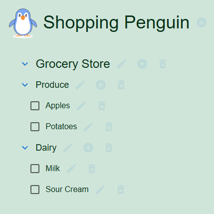

# Shopping Penguin

This project is a custom-built app to track grocery lists and other shopping using React, Express, and MongoDB. It will provide a mobile-friendly interface with AI adaptive auto-complete for easy entry of items.

## Table of contents

- [Overview](#overview)
  - [The goals](#the-goals)
  - [Screenshot](#screenshot)
- [My process](#my-process)
  - [Built with](#built-with)
  - [What I learned](#what-i-learned)
  - [Continued development](#continued-development)
  - [Useful resources](#useful-resources)
- [Author](#author)
- [Acknowledgments](#acknowledgments)

## Overview

### The goals

Users should be able to:

- Create and manage shopping lists
- Add/remove items from lists
- Complete items with a checkbox
- Categorize items (e.g., Fruits, Vegetables, Dairy, etc.)
- Categorize the store for items (Grocery, Hardware, Thrift, etc.)
- Set item quantities and priorities
- Share lists with others
- Sync shopping lists across multiple devices

### Screenshot

## My process

### Built with

- React front-end library
- Material UI components
- Semantic HTML5 markup
- Local storage for data persistence

Coming soon:

- Express.js API
- MongoDB data storage

### What I learned

One of the challenges with this project was working with dates. Between the input and output formats and the functions needed for conversion and comparison, it can get confusing. Also, getting the grid setup for the task lisk took a while to tweak the CSS.

### Useful resources

- [React](https://react.dev/) - React is a powerful JavaScript library for building user interfaces, particularly single-page applications where you need a fast, interactive user experience. React is popular due to its simplicity, efficiency, and scalability, as well as its strong community support.
- [Material UI](https://mui.com/material-ui/material-icons/) - MUI offers a comprehensive suite of free UI tools to help you ship new features faster. Start with Material UI, our fully-loaded component library, or bring your own design system to our production-ready components.

## Author

David Fiel

- Website - [David Fiel](https://fiel.us)

## Acknowledgments

Thanks to all the developers that have built these great tools.
